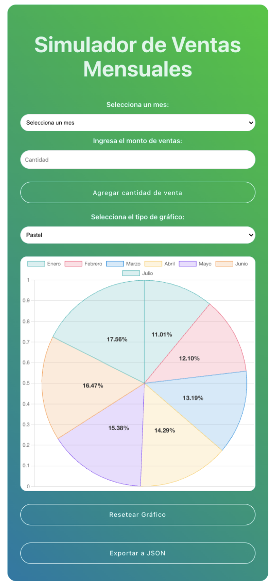

# 📈 Simulador de Ventas con React + Vite

Aplicación para gestionar y visualizar ventas mensuales con persistencia de datos y gráficos interactivos.


## 🚀 Tecnologías Utilizadas
-  - Biblioteca para interfaces de usuario
-  - Bundler frontend ultrarrápido
-  - Gráficos interactivos
-  - Formato para exportaciones


## 🚀 Características principales
- 📝 **Interfaz intuitiva** con formulario de registro
- 📊 **3 tipos de gráficos**: Barras, Líneas y Pastel
- 💾 **Persistencia de datos** con localStorage
- 📤 **Exportación de datos** a JSON
- 📱 **Diseño responsive** con CSS personalizado

## 📂 Estructura del Proyecto
    ```bash
    chart/
    ├── node_modules/              # Dependencias instaladas (automático con npm)
    ├── public/                    # Archivos estáticos (HTML, imágenes, favicon)
    │   └── vite.svg               # Logo de Vite
    ├── src/                       # Código fuente principal
    │   ├── assets/                # Recursos estáticos (CSS, imágenes, fuentes)
    │   ├── components/            # Componentes React reutilizables
    │   │   └── SalesChart.jsx     # Componente gráfico principal
    │   │   └── SalesChart.css     # Estilos del componente gráfico
    │   ├── App.jsx                # Componente raíz de la aplicación
    │   └── main.jsx               # Punto de entrada de la aplicación
    ├── .gitignore                 # Archivos a ignorar por Git
    ├── index.html                 # Plantilla HTML principal
    ├── package.json               # Configuración del proyecto y dependencias
    └── vite.config.js             # Configuración específica de Vite
    ```

## 📦 Instalación
1. **Clonar el repositorio**:
   ```bash
   git clone https://github.com/troxanamanea29/Sales-Data-Visualizer-with-React-and-Chart.js.git


2. **Instalar dependencias**:

    ```bash
   npm install
    ```
3. **Iniciar servidor de desarrollo**:
    ```bash
    npm run dev
    ```

La aplicación React estará disponible en http://localhost:5173

## 💡 Uso
1. Selecciona un mes y ingresa el monto de ventas.
2. Haz clic en "Agregar cantidad de venta".
3. Cambia entre los tipos de gráfico (barras, líneas, pastel).
4. Exporta los datos a JSON con el botón correspondiente.

   
Hecho con ❤️ por roxanamanea29